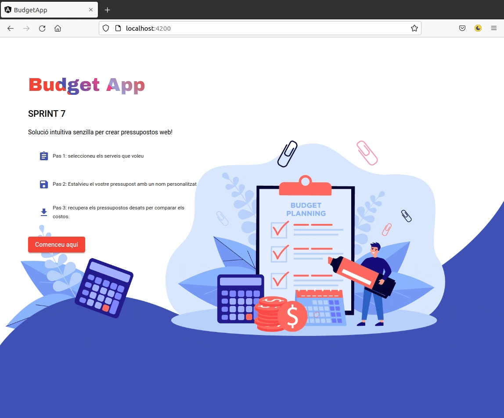
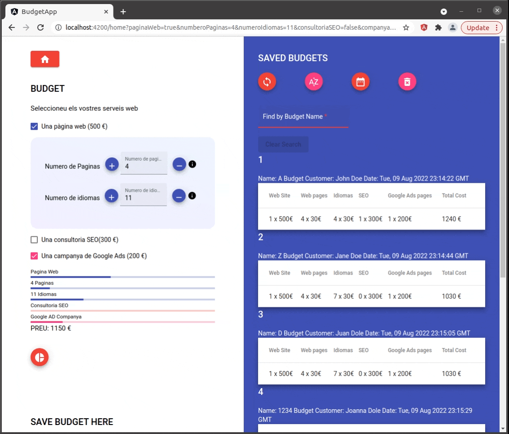

# Sprint 7 - Budget App

The Sprint 7 - Budget App is a fully responsive Angular application that allows users to develop simple web services budgets and then dynamically display that information through charts and figures. The user is then able to save the Budgets through local storage, and upon reloading all the saved budgets remain available to the user. As a final functionality, a user is able to filter through their saved budgets based by the budget's name.

## **Preview**

## 

---

## :wrench: **Tech used in this project**

In this project I used Angular with [Angular Materials](https://material.angular.io/) Libraries components to develop a web app that allows users to save their web services budgets. I used an <b>Angular service</b> shared by various components to update the total amount. Different page links are handled through [Angular's router](https://angular.io/api/router) module. The user begins in the welcome page, and then is taken to the main budget page, which has several check boxes and inputs fields to allow customizing the numbers in the budget. Angular's [Reactive forms](https://angular.io/guide/reactive-forms) handles the inputs that modify the budget total. Modals from Angular Materials provides helpful feedback to users upon clicking "?" buttons. If the user would like to save the budget, a save budget feature is provided where the user can save the budget with a name and customer fields. The saved budgets are then displayed in the saved budgets component on the right with [local storage](https://developer.mozilla.org/es/docs/Web/API/Window/localStorage).

As a bonus feature, I implemented a Donut Chart from [ApexCharts](https://apexcharts.com/docs/angular-charts/) that dynamically updates with each checkmarked button or input update.

The user can filter the saved budgets through the use of a <b>budget-list service</b>. To help faciliate the search process, I created a custom [Angular Pipe](https://angular.io/guide/pipes) that highlights the search term as the user types in the letters.

## 

Finally, each change in the budget modifies the website url through the use of Angular's [Router Params](https://angular.io/guide/router) and [Query Params Handling](https://angular.io/api/router/QueryParamsHandling). Each time the budget changes, parameters in the url change. A user can copy and paste the exact url link, and the budgets will appear with exactly those matching budget parameters.

---

## :mortar_board: **What did I learn from this project**

In this project I learned how to implement Angular Material's components, Reactive Forms, Services, Local Storage, handling of link parameters, and how to implement Pipes.
Because of the various requirements, I had to figure out how to best break down the app into manageable components. In contrast to the passing of parameters from child to parent, services made much more sense in data handling.

---

## :memo: **What do I still need to do**

1. Implement individual delete function on each saved Budget.

2. Create a modal asking the user if they are sure they want to delete all Saved Budgets.

3. Implement unit tests to ensure filtering function works exactly as intended.

4. Additional styling to saved budget lists .

5. Refactor the code.

---

## :seedling: **Getting Started with this project**

This project was generated with [Angular CLI](https://github.com/angular/angular-cli) version 14.0.1.

## Development server

Run `ng serve` for a dev server. Navigate to `http://localhost:4200/`. The application will automatically reload if you change any of the source files.

## Installation

Clone or fork the Repo, and ensure that you have the [Angular CLI](https://github.com/angular/angular-cli) installed.

In the project directory.

```bash
npm install
```

In the project directory.

```bash
ng serve --open
```

## :bookmark_tabs: **Usage Instructions**

Upon starting live server, you will begin in the Welcome Page. Click the "comenceu aqui" button, and you will then proceed to the main budget home page. select the services you want and a final price will be generated for you. Below that click on the circular button to see an interactive donut chart of the budget. When you are ready to save the budget give a budget name and a client name. If you miss one field, you will not be able to save the budget. On the desktop, you will see your saved budgets on the right. Use the buttons on the top of your "SAVED BUDGETS" to sort alphabetically, organize by upload date, or delete all saved budgets.

## Contributing

Pull requests are welcome. For major changes, please open an issue first to discuss what you would like to change.

Please make sure to update tests as appropriate.

## License

[MIT](https://choosealicense.com/licenses/mit/)
